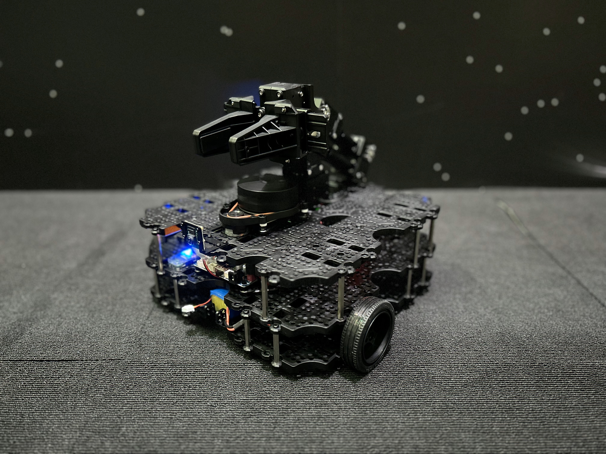
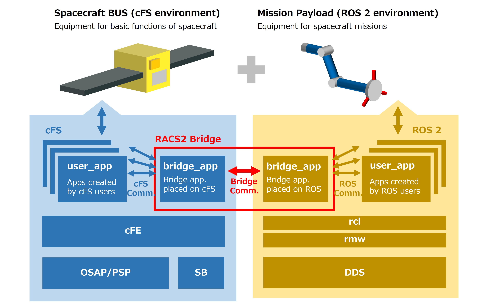
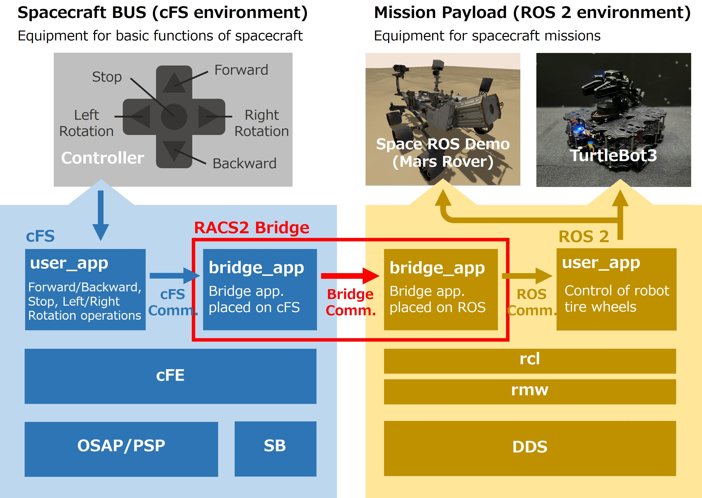

# Space ROS (RACS2) Demonstration Based on TurtleBot3

[](./README.md)
[](./README_JA.md)





## Table of Contents
1. [**What is Space ROS (RACS2) Demonstration Based on TurtleBot3?**](#what-is-space-ros-racs2-demonstration-based-on-turtlebot3)

2. [**Software Environment Setup**](#software-environment-setup)
    1. [Preparation for Setup](#preparation-for-setup)
    2. [PC Setup](#pc-setup)
    3. [TurtleBot3 - Raspberry Pi Setup](#turtlebot3---raspberry-pi-setup)
    4. [TurtleBot3 - OpenCR Setup](#turtlebot3---opencr-setup)
    5. [cFS (Core Flight System) Setup](#cfs-core-flight-system-setup)
    6. [RACS2 (ROS 2 and cFS System) Setup](#racs2-ros-2-and-cfs-system-setup)

3. [**Software Operation Instructions**](#software-operation-instructions)
    1. [Preconditions for Operation](#preconditions-for-operation)
    2. [Launching the TurtleBot3 Control Software](#launching-the-turtlebot3-control-software)
    3. [Launching racs2_bridge](#launching-racs2_bridge)
    4. [Launching the cFS Application](#launching-the-cfs-application)
    5. [How to Operate](#how-to-operate)


## What is Space ROS (RACS2) Demonstration Based on TurtleBot3

This package is a demonstration platform for running the Space ROS (RACS2) open-source platform for space robots on an actual robot.

RACS2 (ROS 2 and cFS System), a part of Space ROS, is a package that integrates NASA's flight-proven Core Flight System (cFS) with ROS 2. The cFS provides support for ensuring spacecraft-grade safety and reliability in space systems using ROS 2.



This package allows you to run RACS2, a part of Space ROS, on an actual robot. Specifically, it operates cFS, RACS2, and ROS 2 on the Raspberry Pi 4, which serves as the computer for the TurtleBot3.



The robot setup features the TurtleBot3 Waffle Pi, the official robot of ROS, optionally paired with the Open MANIPULATOR-X. However, the Open MANIPULATOR-X is not required to operate this package.

Please refer to the following for the RACS2 demo on Space ROS:

- [RACS2 demo on Space ROS](https://github.com/space-ros/demos/tree/main/racs2_demos_on_spaceros)

## Software Environment Setup

### Preparation for Setup

To set up the environment for this package, you will need the following items:

- TurtleBot3 (assembled)
- PC for remote control of the TurtleBot3
- Keyboard (for operating the Raspberry Pi of TurtleBot3)
- Mouse (for operating the Raspberry Pi of TurtleBot3)
- Display (for operating the Raspberry Pi of TurtleBot3)
- Micro SD card (32GB, for Raspberry Pi)

### PC Setup

#### Installing Ubuntu

Download and install Ubuntu on your PC from the following link:

- [Ubuntu 22.04](https://releases.ubuntu.com/22.04/)

Follow the steps below to install Ubuntu on PC:

- [Ubuntu Installation Guide](https://ubuntu.com/tutorials/install-ubuntu-desktop#1-overview)

#### Installing ROS 2

Follow the steps below to install ROS 2 Humble on PC:

- [ROS 2 Installation Guide](https://docs.ros.org/en/humble/Installation/Ubuntu-Install-Debians.html)

Install the required ROS 2 packages:

```
$ sudo apt install ros-humble-gazebo-*
$ sudo apt install ros-humble-cartographer
$ sudo apt install ros-humble-cartographer-ros
$ sudo apt install ros-humble-navigation2
$ sudo apt install ros-humble-nav2-bringup
```

#### Installing TurtleBot3 Packages

Install the TurtleBot3 packages:

```
$ source ~/.bashrc
$ sudo apt install ros-humble-dynamixel-sdk
$ sudo apt install ros-humble-turtlebot3-msgs
$ sudo apt install ros-humble-turtlebot3
```

Build the packages:

```
$ sudo apt remove ros-humble-turtlebot3-msgs
$ sudo apt remove ros-humble-turtlebot3
$ mkdir -p ~/turtlebot3_ws/src
$ cd ~/turtlebot3_ws/src/
$ git clone -b humble https://github.com/ROBOTIS-GIT/DynamixelSDK.git
$ git clone -b humble https://github.com/ROBOTIS-GIT/turtlebot3_msgs.git
$ git clone -b humble https://github.com/ROBOTIS-GIT/turtlebot3.git
$ cd ~/turtlebot3_ws
$ colcon build --symlink-install
$ echo 'source ~/turtlebot3_ws/install/setup.bash' >> ~/.bashrc
$ source ~/.bashrc
```

#### Setting Up the PC Environment

Configure the ROS environment on the PC:

```
$ echo 'export ROS_DOMAIN_ID=30 #TURTLEBOT3' >> ~/.bashrc
$ source ~/.bashrc
```

### TurtleBot3 - Raspberry Pi Setup

Set up the Raspberry Pi on the TurtleBot3.

#### Raspberry Pi Imager Setup

Install the Raspberry Pi Imager on any PC (it can be the same PC used for remote operation of the TurtleBot3). Download it from the following link:

- [Raspberry Pi Imager Installation Guide](https://www.raspberrypi.com/software/)

Insert a micro SD card into the PC and launch the Raspberry Pi Imager. Install Ubuntu Server 22.04 on the micro SD card by following these steps:

1. Click "CHOOSE OS."
2. Select "Other general-purpose OS."
3. Choose "Ubuntu."
4. Select "Ubuntu Server 22.04.5 LTS(RPi 3/4/400) (64-bit)."
5. Choose the inserted micro SD card under "CHOOSE STORAGE."
6. Begin the installation.

After the installation, insert the micro SD card into the Raspberry Pi and connect it to a display, keyboard, and mouse. Perform the installation settings for Ubuntu and restart the system after installation.

#### Setting Up the Raspberry Pi

Since the Raspberry Pi resets the time settings on startup, connect to Wi-Fi to automatically set the time. Edit the `/etc/systemd/timesyncd.conf` file as follows:

```
#
#/etc/systemd/timesyncd.conf
#
[Time]
NTP=ntp.jst.mfeed.ad.jp ntp.nict.jp
FallbackNTP=time.google.com
#FallbackNTP=0.debian.pool.ntp.org 1.debian.pool.ntp.org 2.debian.pool.ntp.org 3.debian.pool.ntp.org
#RootDistanceMaxSec=5
#PollIntervalMinSec=32
#PollIntervalMaxSec=2048
```

Enable NTP:

```
$ sudo timedatectl set-ntp true
```

Restart the service:

```
$ sudo systemctl daemon-reload
$ sudo systemctl restart systemd-timesyncd.service
```

Reboot the Raspberry Pi and confirm the time settings are correct. If the configuration fails, manually set the time using the following command:

```
$ sudo date -s “yyyy/mm/dd hh:mm:ss”
```

Download this package: In `[space turtlebot workspace path]`, enter any file path where you want to store this package.

```
$ cd [space turtlebot workspace path]
$ git clone https://github.com/jaxa/space_ros_turtlebot3_demo.git
```

Follow the steps below to install ROS 2 Humble on the Raspberry Pi:

- [ROS 2 Installation Guide](https://docs.ros.org/en/humble/Installation/Ubuntu-Install-Debians.html)

Install and build the ROS 2 packages:

```
$ sudo apt install python3-argcomplete python3-colcon-common-extensions libboost-system-dev build-essential
$ sudo apt install ros-humble-hls-lfcd-lds-driver
$ sudo apt install ros-humble-turtlebot3-msgs
$ sudo apt install ros-humble-dynamixel-sdk
$ sudo apt install libudev-dev
$ mkdir -p ~/turtlebot3_ws/src && cd ~/turtlebot3_ws/src
$ cp ~/[space turtlebot workspace path]/turtlebot3 ./
$ git clone -b ros2-devel https://github.com/ROBOTIS-GIT/ld08_driver.git
$ cd ~/turtlebot3_ws/src/turtlebot3
$ cd ~/turtlebot3_ws/
$ echo 'source /opt/ros/humble/setup.bash' >> ~/.bashrc
$ source ~/.bashrc
$ colcon build --symlink-install --parallel-workers 1
$ echo 'source ~/turtlebot3_ws/install/setup.bash' >> ~/.bashrc
$ source ~/.bashrc
```

Configure the USB port settings for OpenCR on TurtleBot3:

```
$ sudo cp `ros2 pkg prefix turtlebot3_bringup`/share/turtlebot3_bringup/script/99-turtlebot3-cdc.rules /etc/udev/rules.d/
$ sudo udevadm control --reload-rules
$ sudo udevadm trigger
```

Set the ROS 2 domain ID to match between the PC and TurtleBot3.

```
$ echo 'export ROS_DOMAIN_ID=30 #TURTLEBOT3' >> ~/.bashrc
$ source ~/.bashrc
```

Configure the LDS model:

```
$ echo 'export LDS_MODEL=LDS-02' >> ~/.bashrc
$ source ~/.bashrc
```

### TurtleBot3 - OpenCR Setup

Connect the OpenCR to the Raspberry Pi and install the necessary firmware:

```
$ sudo dpkg --add-architecture armhf
$ sudo apt update
$ sudo apt install libc6:armhf
$ export OPENCR_PORT=/dev/ttyACM0
$ export OPENCR_MODEL=waffle
$ rm -rf ./opencr_update.tar.bz2
```

Download the firmware and loader:

```
$ wget https://github.com/ROBOTIS-GIT/OpenCR-Binaries/raw/master/turtlebot3/ROS2/latest/opencr_update.tar.bz2
$ tar -xvf ./opencr_update.tar.bz2
```

Upload the firmware to OpenCR:

```
$ cd ~/opencr_update
$ ./update.sh $OPENCR_PORT $OPENCR_MODEL.opencr
```

If the upload is successful, `jump_to_fw` will be displayed in the terminal. If the upload fails, refer to section 3.3.7 of the TurtleBot3 e-Manual and try uploading again in recovery mode.

- [TurtleBot3 e-manual](https://emanual.robotis.com/docs/en/platform/turtlebot3/opencr_setup/#opencr-setup)

<!-- ### Open MANIPULATOR-X Setup -->!
<!-- Not implemented -->

### cFS (Core Flight System) Setup

Clone and configure the Core Flight System (cFS): In `[cfs workspace path]`, enter any file path where you want to store cFS.

```
$ cd [cFS workspace path]
$ git clone https://github.com/nasa/cFS.git
$ cd /cFS
$ git checkout v6.7.0a
$ git submodule init
$ git submodule update
```

Copy the sample code:

```
$ cp cfe/cmake/Makefile.sample Makefile
$ cp -r cfe/cmake/sample_defs ./
```

### RACS2 (ROS 2 and cFS System) Setup

Install the racs2_bridge package, which is part of the RACS2 (ROS 2 and cFS System).

#### Advance Preparation

Install WebSocket:

```
$ sudo apt install -y libwebsockets-dev
$ sudo apt install -y pip
$ pip install protobuf websockets
```

Install Protocol Buffers:

```
$ sudo apt install -y libwebsockets-dev protobuf-c-compiler libprotobuf-c-dev libprotobuf-dev
```

#### Settings on the ROS 2 side

Place the `bridge node` in the `turtlebot3_ws`:

```
$ cp -pr ~/[Space TurtleBot workspace path]/space_ros_turtlebot3_demo/racs2_bridge/ROS2/Bridge/Server_Python/bridge_py_s ~/turtlebot3_ws/src
```

Return to the root of the TurtleBot3 project and build it:

```
$ cd ~/turtlebot3_ws
$ colcon build --symlink-install --parallel-workers 1
```

#### Settings on the cFS side

Deploy the bridge app to the cFS environment:

```
$ cp -pr ~/[Space TurtleBot workspace path]/space_ros_turtlebot3_demo/racs2_bridge/cFS/Bridge/Client_C/apps/racs2_bridge_client ~/[cFS workspace path]/cFS/apps/
$ cp -pr ~/[Space TurtleBot workspace path]/space_ros_turtlebot3_demo/racs2_bridge/Example/Case.X/cFS/sample_defs/* ~/[cFS workspace path]/cFS/sample_defs/
$ cp -pr ~/[Space TurtleBot workspace path]/space_ros_turtlebot3_demo/racs2_bridge/Example/Case.X/cFS/apps/run_app  ~/[cFS workspace path]/cFS/apps/
```

Edit L.205 of `[cFS workspace path]/cFS/sample_defs/default_osconfig.h` as follows:

```
#define OSAL_DEBUG_PERMISSIVE_MODE
```

Return to the root of the cFS project and build it:

```
$ cd [cFS project path]
$ make prep
$ make
$ make install
```

The software environment setup is complete.


## Software Operation Instructions

### Preconditions for Operation

You can operate the robot either directly via the Raspberry Pi or remotely from a PC. This guide uses the remote operation method.

### Launching the TurtleBot3 Control Software

Connect to the Raspberry Pi via SSH from the PC: In `[raspberry pi hostname]`, enter the hostname of the Raspberry Pi, and in `[raspberry pi ip address]`, enter the IP address of the Raspberry Pi.

```
$ ssh [raspberry pi hostname]@[raspberry pi ip address]
```

After connecting, navigate to the TurtleBot3 project path and configure the parameters.

```
$ cd ~/turtlebot3_ws
$ source install/setup.bash
$ export TURTLEBOT3_MODEL=waffle_pi
```

Launch the TurtleBot3 control software:

```
$ ros2 launch turtlebot3_bringup robot.launch.py
```

### Launching racs2_bridge

Open another terminal and connect to the Raspberry Pi via SSH from the PC using the same steps.

```
$ ssh [raspberry pi hostname]@[raspberry pi ip address]
```

After connecting, navigate to the TurtleBot3 project path:

```
$ cd ~/turtlebot3_ws
$ source install/setup.bash
```

Launch the node:

```
$ ros2 run bridge_py_s bridge_py_s_node --ros-args --params-file ./src/bridge_py_s/config/params.yaml
```

### Launching the cFS Application

Open another terminal and connect to the Raspberry Pi via SSH from the PC using the same steps.

```
$ ssh [raspberry pi hostname]@[raspberry pi ip address]
```

After connecting, navigate to the cFS project path and launch the application:

```
$ cd [cFS workspace path]/cFS/build/exe/cpu1
$ ./core-cpu1
```

### How to Operate

You can control the robot's speed by entering commands via the keyboard in the cFS terminal. The commands are configured as follows:

| Key |   Action   | Speed Change |    Limits    |
|:---:|:----------:|:------------:|:------------:|
|  w  |  Forward   | +0.01 [m/s]  |  0.26 [m/s]  |
|  x  |  Backward  | -0.01 [m/s]  | -0.26 [m/s]  |
|  a  | Turn Left  | +0.1 [rad/s] |  1.8 [rad/s] |
|  d  | Turn Right | -0.1 [rad/s] | -1.8 [rad/s] |
|  s  |    Stop    |       0      |     N/A      |

To stop the program, press `[Ctrl] + [C]` in each terminal.

---

[Back to Top](#space-ros-racs2-demonstration-based-on-turtlebot3)

