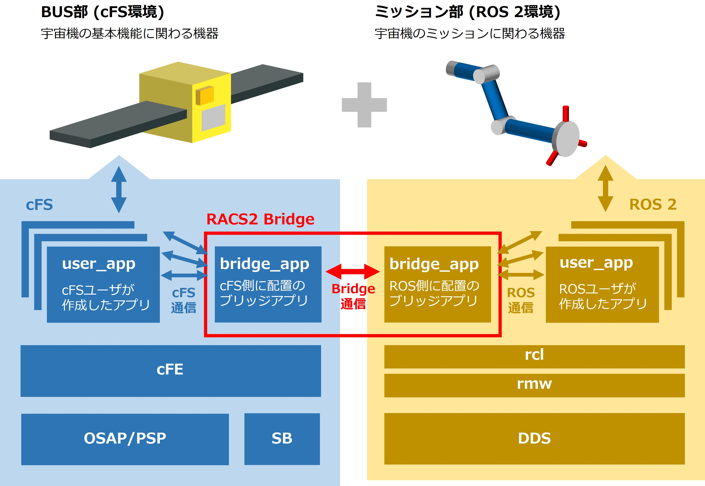
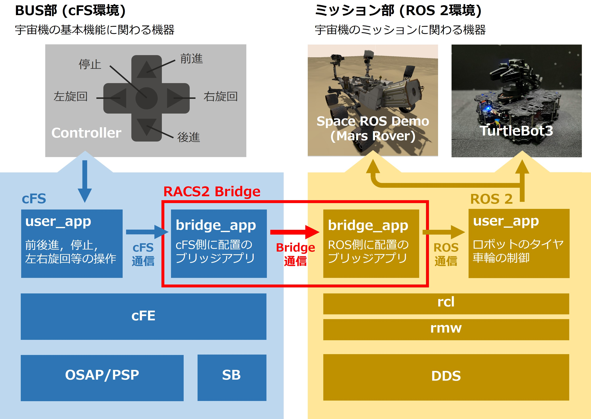

# Space ROS (RACS2) demonstration based on TurtleBot3

[](./README.md)
[](./README_JA.md)


## 目次
1. [**Space ROS (RACS2) demonstration based on TurtleBot3とは？**](#space-ros-racs2-demonstration-based-on-turtlebot3とは)

2. [**ソフトウェア環境構築手順**](#ソフトウェア環境構築手順)
    1. [環境構築準備](#環境構築準備)
    2. [PCのセットアップ](#pcのセットアップ)
    3. [TurtleBot3 - Raspberry Piのセットアップ](#turtlebot3---raspberry-piのセットアップ)
    4. [TurtleBot3 - OpenCRのセットアップ](#turtlebot3---opencrのセットアップ)
    5. [cFS(core Flght System)のセットアップ](#cfscore-flght-systemのセットアップ)
    6. [RACS2(ROS 2 and cFS System)のセットアップ](#racs2ros-2-and-cfs-systemのセットアップ)

3. [**ソフトウェア操作手順**](#ソフトウェア操作手順)
    1. [操作の前提](#操作の前提)
    2. [TurtleBot3制御ソフトウェアの起動](#turtlebot3制御ソフトウェアの起動)
    3. [racs2_bridgeの起動](#racs2_bridgeの起動)
    4. [cFSアプリの起動](#cfsアプリの起動)
    5. [操作方法](#操作方法)


## Space ROS (RACS2) demonstration based on TurtleBot3とは？

本パッケージは、宇宙ロボットのオープンソースプラットフォームであるSpace ROS(RACS2)を実機ロボット上で動作させるための実証プラットフォームです。

Space ROSの一部であるRACS2(ROS 2 and cFS System)は、フライト実績のあるNASAのフライトソフトウェアであるcFS(core Flight System)とROS 2を連携するパッケージです。cFSにより、ROS 2を用いた宇宙機システムで、宇宙機品質の安全性・信頼性を確保するサポートができます。



本パッケージでは、実機ロボット上でSpace ROSの一部であるこのRACS2を動かすことができます。具体的には、Turtlebot3のコンピュータであるRaspberry Pi 4上で、cFS、RACS2、ROS2を動作させます。



ロボットは、ROSの公式ロボットであるTurtleBot 3 Waffle PiとOpen MANIPULATOR-Xを組み合わせた構成となっています。ただし、本パッケージ自体は、TurtleBot3のみでも動作するので、Open MANIPULATOR-Xが無くても問題ありません。


## ソフトウェア環境構築手順

### 環境構築準備

本パッケージを動作させる環境構築を行うため、以下のものが必要です。

- TurtleBot3 (組み立て済み)
- TurtleBot3をリモート操作するためのPC
- キーボード (Turtlebot3のRaspberry Pi操作用)
- マウス (Turtlebot3のRaspberry Pi操作用)
- ディスプレイ (Turtlebot3のRaspberry Pi操作用)
- micro SDカード (Turtlebot3のRaspberry Pi用、32GBが必要)

### PCのセットアップ

#### Ubuntuのインストール

以下のリンクから、PCにUbuntuをダウンロードしてインストールします。

- [Ubuntu 22.04](https://releases.ubuntu.com/22.04/)

以下の手順に従い、Ubuntuをインストールします。

- [Ubuntuインストールガイド](https://ubuntu.com/tutorials/install-ubuntu-desktop#1-overview)

#### ROS 2のインストール

以下の手順に従い、ROS 2 Humbleをインストールします。

- [ROS 2インストールガイド](https://docs.ros.org/en/humble/Installation/Ubuntu-Install-Debians.html)

以下のコマンドを実行し、依存するROS2パッケージをインストールします。

```
$ sudo apt install ros-humble-gazebo-*
$ sudo apt install ros-humble-cartographer
$ sudo apt install ros-humble-cartographer-ros
$ sudo apt install ros-humble-navigation2
$ sudo apt install ros-humble-nav2-bringup
```

#### TurtleBot3パッケージのインストール

以下のコマンドを実行して、Debianパッケージ経由でTurtleBot3の関連パッケージをインストールします。

```
$ source ~/.bashrc
$ sudo apt install ros-humble-dynamixel-sdk
$ sudo apt install ros-humble-turtlebot3-msgs
$ sudo apt install ros-humble-turtlebot3
```

以下のコマンドを実行して、パッケージのビルドを行います。

```
$ sudo apt remove ros-humble-turtlebot3-msgs
$ sudo apt remove ros-humble-turtlebot3
$ mkdir -p ~/turtlebot3_ws/src
$ cd ~/turtlebot3_ws/src/
$ git clone -b humble-devel https://github.com/ROBOTIS-GIT/DynamixelSDK.git
$ git clone -b humble-devel https://github.com/ROBOTIS-GIT/turtlebot3_msgs.git
$ git clone -b humble-devel https://github.com/ROBOTIS-GIT/turtlebot3.git
$ cd ~/turtlebot3_ws
$ colcon build --symlink-install
$ echo 'source ~/turtlebot3_ws/install/setup.bash' >> ~/.bashrc
$ source ~/.bashrc
```

#### PCの環境設定

以下のコマンドを実行して、PCのROS環境を設定します。

```
$ echo 'export ROS_DOMAIN_ID=30 #TURTLEBOT3' >> ~/.bashrc
$ source ~/.bashrc
```

### TurtleBot3 - Raspberry Piのセットアップ

TurtleBot3上にあるRaspberry Piのセットアップを行います。

#### Raspberry Pi Imagerでのセットアップ

任意のPCにRaspberry Pi Imagerをインストールします (TurtleBot3のリモート操作に使用するPCと同じもので構いません)。

- [Raspberry Pi Imagerインストールガイド](https://www.raspberrypi.com/software/)

インストール後、micro SDカードをPCに挿入し、Raspberry Pi Imagerを起動します。起動したら、以下の手順に従い、micro SDにUbuntu Server 22.04をインストールします。

1. 「CHOOSE OS」をクリックする。
2. 「Other general-purpose OS」をクリックする。
3. 「Ubuntu」を選択する。
4. 「Ubuntu Server 22.04.5 LTS(RPi 3/4/400) (64-bit)」を選択する。
5. CHOOSE STORAGEで挿入したmicro SDカードを選択する。
6. 書き込みを実行する。

書き込みが完了したら、micro SDカードをRaspberry Piに移します。そして、Raspberry Piにディスプレイ、キーボード類を接続した上で、Ubuntuのインストール設定とインストールを行います。インストールが完了したら、再起動します。

#### Raspberry Piのセットアップ

Raspberry Piは起動時時刻設定がリセットされるため、ネットワーク設定からWi-Fiに接続し、自動で時刻を設定するようにします。設定ファイルである`/etc/systemd/timesyncd.conf`を開き、以下のように編集します。

```
#
#/etc/systemd/timesyncd.conf
#
[Time]
NTP=ntp.jst.mfeed.ad.jp ntp.nict.jp
FallbackNTP=time.google.com
#FallbackNTP=0.debian.pool.ntp.org 1.debian.pool.ntp.org 2.debian.pool.ntp.org 3.debian.pool.ntp.org
#RootDistanceMaxSec=5
#PollIntervalMinSec=32
#PollIntervalMaxSec=2048
```

以下のコマンドを実行して、NTPの有効化します。

```
$ sudo timedatectl set-ntp true
```

以下のコマンドを実行して、サービスを再起動します。

```
$ sudo systemctl daemon-reload
$ sudo systemctl restart systemd-timesyncd.service
```

Raspberry Piの再起動を行い、時刻があっていることを確認します。この際、環境により設定がうまくいかない場合があります。その場合は、他の方法を試すか、起動時に以下のコマンドを実行してみてください。

```
$ sudo date -s “yyyy/mm/dd hh:mm:ss”
```

以下のコマンドを実行し、本パッケージをダウンロードします。`[Space TurtleBot workspace path]`には、本パッケージを格納する任意のファイルパスを入力してください。

```
$ cd [space turtlebot workspace path]
$ git clone https://github.com/jaxa/space_ros_turtlebot3_demo.git
```

以下のROS 2インストールガイドを使ってROS 2 HumbleをRaspberry Piにインストールします。

- [ROS 2 Installation Guide](https://docs.ros.org/en/humble/Installation/Ubuntu-Install-Debians.html)

以下のコマンドを実行して、ROS 2パッケージをインストール & ビルドします。

```
$ sudo apt install python3-argcomplete python3-colcon-common-extensions libboost-system-dev build-essential
$ sudo apt install ros-humble-hls-lfcd-lds-driver
$ sudo apt install ros-humble-turtlebot3-msgs
$ sudo apt install ros-humble-dynamixel-sdk
$ sudo apt install libudev-dev
$ mkdir -p ~/turtlebot3_ws/src && cd ~/turtlebot3_ws/src
$ cp ~/[space turtlebot workspace path]/turtlebot3 ./
$ git clone -b ros2-devel https://github.com/ROBOTIS-GIT/ld08_driver.git
$ cd ~/turtlebot3_ws/src/turtlebot3
$ cd ~/turtlebot3_ws/
$ echo 'source /opt/ros/humble/setup.bash' >> ~/.bashrc
$ source ~/.bashrc
$ colcon build --symlink-install --parallel-workers 1
$ echo 'source ~/turtlebot3_ws/install/setup.bash' >> ~/.bashrc
$ source ~/.bashrc
```

以下のコマンドを実行し、TurtleBot3に搭載しているOpenCRのUSBポート設定を行います。

```
$ sudo cp `ros2 pkg prefix turtlebot3_bringup`/share/turtlebot3_bringup/script/99-turtlebot3-cdc.rules /etc/udev/rules.d/
$ sudo udevadm control --reload-rules
$ sudo udevadm trigger
```

以下のコマンドを実行し、PCとTurtleBot3の間でROS 2のドメインIDを一致させます。

```
$ echo 'export ROS_DOMAIN_ID=30 #TURTLEBOT3' >> ~/.bashrc
$ source ~/.bashrc
```

以下のコマンドを実行し、LDSモデルの設定を行います。

```
$ echo 'export LDS_MODEL=LDS-02' >> ~/.bashrc
$ source ~/.bashrc
```

### TurtleBot3 - OpenCRのセットアップ

OpenCRとRaspberry Piを接続し、以下のコマンドを実行して、必要なパッケージをRaspberry Piにインストールします。

```
$ sudo dpkg --add-architecture armhf
$ sudo apt update
$ sudo apt install libc6:armhf
$ export OPENCR_PORT=/dev/ttyACM0
$ export OPENCR_MODEL=waffle
$ rm -rf ./opencr_update.tar.bz2
```

以下のコマンドを実行し、ファームウェアとローダーのダウンロードを行います。

```
$ wget https://github.com/ROBOTIS-GIT/OpenCR-Binaries/raw/master/turtlebot3/ROS2/latest/opencr_update.tar.bz2
$ tar -xvf ./opencr_update.tar.bz2
```

以下のコマンドを実行し、ファームウェアをOpenCRにアップロードします。

```
$ cd ~/opencr_update
$ ./update.sh $OPENCR_PORT $OPENCR_MODEL.opencr
```

正常にアップロードされると、ターミナルに`jump_to_fw`が表示されます。もし失敗した場合は、以下TurtleBot3 e-manualの3.3.7を参考にリカバリーモードで再度アップロードしてみてください。

- [TurtleBot3 e-manual](https://emanual.robotis.com/docs/en/platform/turtlebot3/opencr_setup/#opencr-setup)

<!-- ### Open MANIPULATOR-Xのセットアップ -->
<!-- 未実装 -->

### cFS(core Flght System)のセットアップ

以下のコマンドを実行し、cFS(core Flght System)をダウンロードします。`[cFS workspace path]`には、cFSを格納する任意のファイルパスを入力してください。

```
$ cd [cFS workspace path]
$ git clone https://github.com/nasa/cFS.git
$ cd /cFS
$ git checkout v6.7.0a
$ git submodule init
$ git submodule update
```

以下のコマンドを実行し、サンプルコードをコピーします。

```
$ cp cfe/cmake/Makefile.sample Makefile
$ cp -r cfe/cmake/sample_defs ./
```

### RACS2(ROS 2 and cFS System)のセットアップ

RACS2(ROS 2 and cFS System)のパッケージである`racs2_bridge`をインストールします。

#### 事前準備

事前準備として、以下のコマンドを実行し、WebSocketをインストールします。

```
$ sudo apt install -y libwebsockets-dev
$ sudo apt install -y pip
$ pip install protobuf websockets
```

以下のコマンドを実行し、Protocol Buffersをインストールします。

```
$ sudo apt install -y libwebsockets-dev protobuf-c-compiler libprotobuf-c-dev libprotobuf-dev
```

#### ROS 2側の設定

以下のコマンドを実行し、`turtlebot3_ws`に`bridge node`を配置します。

```
$ cp -pr ~/[Space TurtleBot workspace path]/space_ros_turtlebot3_demo/racs2_bridge/ROS2/Bridge/Server_Python/bridge_py_s ~/turtlebot3_ws/src
```

以下のコマンドを実行し、TurtleBot3プロジェクトの先頭に戻り、ビルドを行います。

```
$ cd ~/turtlebot3_ws
$ colcon build --symlink-install --parallel-workers 1
```

#### cFS側のセットアップ

以下のコマンドを実行し、cFS環境にbridgeアプリを配置します。

```
$ cp -pr ~/[Space TurtleBot workspace path]/space_ros_turtlebot3_demo/racs2_bridge/cFS/Bridge/Client_C/apps/racs2_bridge_client ~/[cFS workspace path]/cFS/apps/
$ cp -pr ~/[Space TurtleBot workspace path]/space_ros_turtlebot3_demo/racs2_bridge/Example/Case.X/cFS/sample_defs/* ~/[cFS workspace path]/cFS/sample_defs/
$ cp -pr ~/[Space TurtleBot workspace path]/space_ros_turtlebot3_demo/racs2_bridge/Example/Case.X/cFS/apps/run_app  ~/[cFS workspace path]/cFS/apps/
```

`[cFS workspace path]/cFS/sample_defs/default_osconfig.h`のL.205を以下のように編集します。

```
#define OSAL_DEBUG_PERMISSIVE_MODE
```

cFSプロジェクトの先頭に戻り、ビルドを行います。

```
$ cd [cFS project path]
$ make prep
$ make
$ make install
```

以上で、ソフトウェアの環境構築は完了です。


## ソフトウェア操作手順

### 操作の前提

本パッケージでのロボットの操作は、Raspberry Piから直接操作する方法と、PCからのリモートで接続し、操作する方法があります。ここでは、例としてPCからのリモートで接続し、操作する方法を用います。

### TurtleBot3制御ソフトウェアの起動

以下のコマンドを実行し、PCからRaspberry Piにssh接続します。`[raspberry pi hostname]`には、Raspberry Piのホスト名を入力します。また、`[raspberry pi ip address]`には、Raspberry PiのIPアドレスを入力してください。

```
$ ssh [raspberry pi hostname]@[raspberry pi ip address]
```

接続後、TurtleBot3プロジェクトパスに移動し、パラメータ設定を行います。

```
$ cd ~/turtlebot3_ws
$ source install/setup.bash
$ export TURTLEBOT3_MODEL=waffle_pi
```

以下のコマンドを実行し、TurtleBot3制御ソフトウェアを起動します。

```
$ ros2 launch turtlebot3_bringup robot.launch.py
```

### racs2_bridgeの起動

別のターミナルを起動し、同様の手順で、PCからRaspberry Piにssh接続します。

```
$ ssh [Raspberry Pi hostname]@[Raspberry PiのIPアドレス]
```

接続後、以下のコマンドを実行し、TurtleBot3プロジェクトパスに移動します。

```
$ cd ~/turtlebot3_ws
$ source install/setup.bash
```

以下のコマンドを実行し、ノードを起動します。

```
$ ros2 run bridge_py_s bridge_py_s_node --ros-args --params-file ./src/bridge_py_s/config/params.yaml
```

### cFSアプリの起動

別のターミナルを起動し、同様の手順で、PCからRaspberry Piにssh接続します。

```
$ ssh [Raspberry Pi hostname]@[Raspberry PiのIPアドレス]
```

接続後、cFSプロジェクトパスに移動し、アプリの起動を行います。上記のTurtleBot3、racs2_bridgeの起動処理の完了後にcFSアプリの起動を行います。

```
$ cd [cFS workspace path]/cFS/build/exe/cpu1
$ ./core-cpu1
```

### 操作方法

cFSのターミナルでキーボード入力をすることにより、ロボットの速度を操作します。コマンドは以下のように設定されています。

| 入力キー |  動作  |   動作速度   |  上限値・下限値 |
|:-------:|:------:|:-----------:|:--------------:|
|    w    |  前進  | +0.01 [m/s]  |    0.26 [m/s]  |
|    x    |  後進  | -0.01 [m/s]  |   -0.26 [m/s]  |
|    a    | 左旋回 | +0.1 [rad/s] |    1.8 [rad/s] |
|    d    | 右旋回 | -0.1 [rad/s] |   -1.8 [rad/s] |
|    s    |  停止  |       0      |       N/A      |

プログラムを終了する際は、各ターミナルで[Ctrl]+[C]キーを入力します。

---

[トップに戻る](#space-ros-racs2-demonstration-based-on-turtlebot3)
